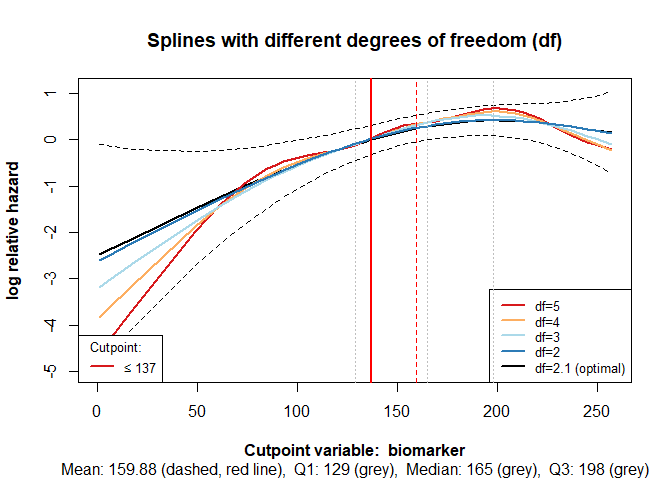
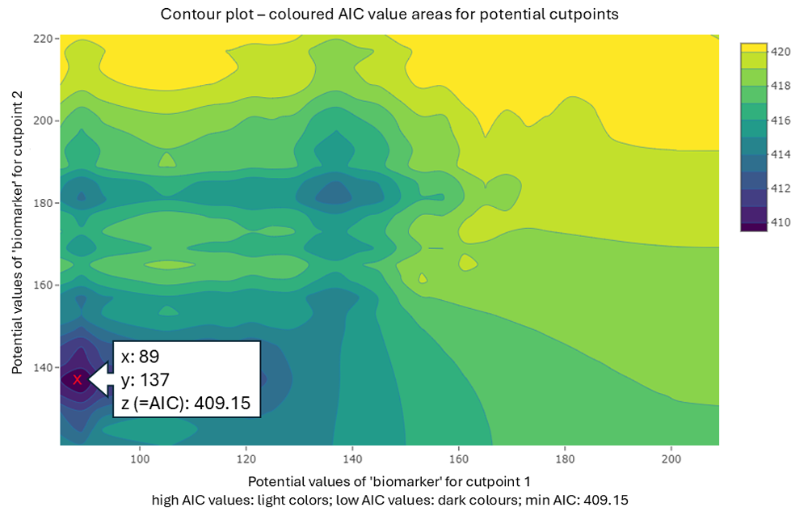
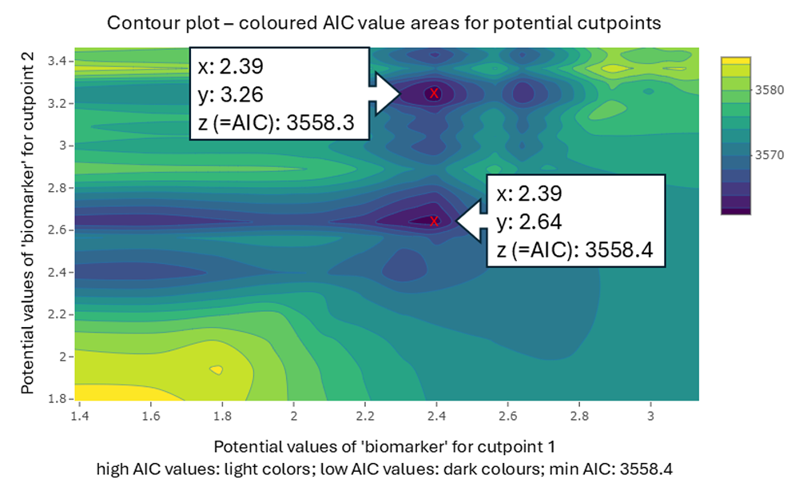
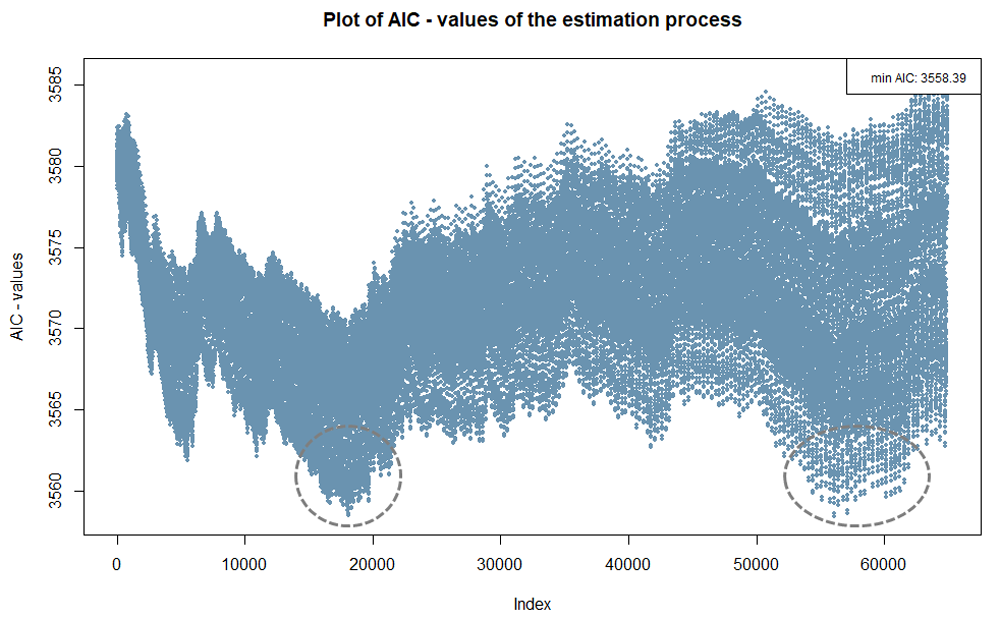
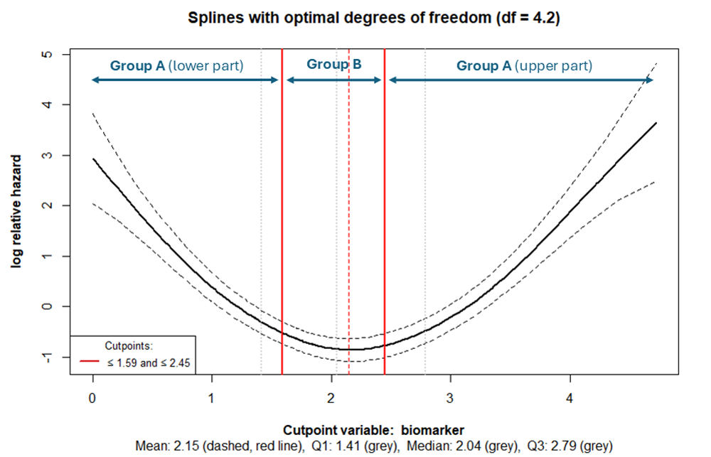

<!-- README.md is generated from README.Rmd. Please edit that file -->

# cutpoint: Estimate cutpoints in a multivariable setting for survival data or time-to-event data


**Jan Porthun** \| [NTNU: Norwegian University of Science and
Technology](https://www.ntnu.edu/employees/jan.porthun)

------------------------------------------------------------------------

The R package `cutpoint` is used to determine cutpoints of variables,
such as biomarkers, in the multivariable context of survival or
time-to-event analyses. These cutpoints are applied to form groups with
different probabilities of an event occurring.

For example, in medical research, cutpoints of biomarkers are formed to
classify patients into different risk groups regarding survival in tumor
diseases. Using the R package `cutpoint`, it is possible to estimate one
or two cutpoints for categorising a variable of interest, while taking
other relevant variables into account. Thus, it is possible, for
instance in the medical context, not only to estimate a cutpoint based
on a single biomarker but also to consider other biomarkers or baseline
characteristics.

The R package `cutpoint` uses either the AIC (Akaike Information
Criterion) or the LRT (Likelihood-Ratio Test statistic) to estimate the
cutpoint in the context of Cox-regressions. The Likelihood Ratio Test
statistic is calculated by taking the scaled difference between the
log-likelihoods of the model and the null model’s log-likelihoods.
Details on the methods can be found in the article by Govindarajulu, U.,
& Tarpey, T. (2022). Optimal partitioning for the proportional hazards
model. Journal of Applied Statistics, 49(4), 968–987.
<https://doi.org/10.1080/02664763.2020.1846690>

The `cp_est` function estimates one or two cutpoints for a biomarker.
The argument `ushape` enables cutpoints to be estimated assuming the
splines plot displays a U-shaped or inverted U-shaped curve. The
`symtail` argument allows for the estimation of two cutpoints, ensuring
that the two outer tails represent groups of approximately the same
size.

------------------------------------------------------------------------

## :arrow_double_down: Installation

You can install the development version of cutpoint from
[GitHub](https://github.com/) with:

``` r
# install.packages("pak")
pak::pak("jan-por/cutpoint")
```

------------------------------------------------------------------------

## Example

**Estimate one cutpoint of the variable biomarker under consideration of
two other covariates.**

For this example, the dataset `data1`, included in the R-package
`cutpoint`, is used. It has 100 observations and contains the variables:

- time, event, biomarker, covariate_1, and covariate_2

Because one cutpoint should be estimated, the argument `nb_of_cp` is set
to 1. (`nb_of_cp = 1`)

For the other arguments, their default settings are used:

- Min. group size in % `bandwidth = 0.1`

- Estimation type `est_type = "AIC"`

- Cutpoint variable as strata in Cox model? `cpvar_strata = FALSE`
  (FALSE: not as strata)

- Symmetric tails `symtails = FALSE`

- Cutpoints for u-shape `ushape = FALSE`

``` r
library(cutpoint) 
cpobj <- cp_est(
   cpvarname = "biomarker", 
   covariates = c("covariate_1", "covariate_2"), 
   data = data1, 
   nb_of_cp = 1
   )
```

#### Output:

The output displays the primary settings and the cutpoint:

    #> 
    #> Approx. remaining time for estimation: 0 seconds 
    #> --------------------------------------------------------------------
    #> SETTINGS:
    #>  Cutpoint-variable                    =  biomarker 
    #>  Number of cutpoints   (nb_of_cp)     =  1 
    #>  Min. group size in %  (bandwith)     =  0.1 
    #>  Estimation type       (est_type)     =  AIC 
    #>  CP-variable as strata (cpvar_strata) =  FALSE 
    #>  Symmetric tails       (symtails)     =  FALSE   (is set to FALSE if nb_of_cp = 1)
    #>  Cutpoints for u-shape (ushape)       =  FALSE   (is set to FALSE if nb_of_cp = 1)
    #> --------------------------------------------------------------------
    #> Covariates or factors are:
    #>   covariate_1 covariate_2 
    #> --------------------------------------------------------------------
    #> Minimum group size is 10 (10% of sample size in original dataset, N = 100)
    #> --------------------------------------------------------------------
    #> Number of cutpoints searching for: 1 
    #> Cutpoint: biomarker ≤ 89 
    #> -----------------------------------------------------------------
    #> Group size in relation to valid data of biomarker in original data set
    #>  Total:   N = 100 (100%)
    #>  Group A: n = 12 (12%)
    #>  Group B: n = 88 (88%)

The argument `bandwidth` can change the minimum group sizes and may lead
to different cutpoint estimates.

------------------------------------------------------------------------

 

Other cutpoints may be estimated if no covariates (`covariates = NULL`)
are included in the cutpoint search:

``` r
library(cutpoint)
cpobj <- cp_est(
   cpvarname = "biomarker", 
   covariates = NULL, 
   data = data1, 
   nb_of_cp = 1
)
```

#### Output:

With covariates, the cutpoint was ≤ 89; without covariates the cutpoint
is ≤ 137.

    #> 
    #> Approx. remaining time for estimation: 0 seconds 
    #> --------------------------------------------------------------------
    #> SETTINGS:
    #>  Cutpoint-variable                    =  biomarker 
    #>  Number of cutpoints   (nb_of_cp)     =  1 
    #>  Min. group size in %  (bandwith)     =  0.1 
    #>  Estimation type       (est_type)     =  AIC 
    #>  CP-variable as strata (cpvar_strata) =  FALSE 
    #>  Symmetric tails       (symtails)     =  FALSE   (is set to FALSE if nb_of_cp = 1)
    #>  Cutpoints for u-shape (ushape)       =  FALSE   (is set to FALSE if nb_of_cp = 1)
    #> --------------------------------------------------------------------
    #> No covariates were selected
    #> --------------------------------------------------------------------
    #> Minimum group size is 10 (10% of sample size in original dataset, N = 100)
    #> --------------------------------------------------------------------
    #> Number of cutpoints searching for: 1 
    #> Cutpoint: biomarker ≤ 137 
    #> -----------------------------------------------------------------
    #> Group size in relation to valid data of biomarker in original data set
    #>  Total:   N = 100 (100%)
    #>  Group A: n = 29 (29%)
    #>  Group B: n = 71 (71%)

------------------------------------------------------------------------

 

### Visual evaluation of possible cutpoints

The `cp_value_plot` and `cp_splines_plot` functions are utilised to
choose the appropriate cutpoints.

The default plot of the function `cp_est` is a splines plot with
different degrees of freedom. This plot can also be generated with the
following function:

``` r
cp_splines_plot(cpobj, show_splines = TRUE)
```



Figure 1. Splines with different degrees of freedom (df)

 

The cutpoint is shown as a vertical red line, while the dashed red line
represents the mean of the variable of interest. The first quartile,
median, and third quartile are indicated in grey. The lines, which are
based on different degrees of freedom should facilitate in determining,
whether misspecification or overfitting occurs. The former example does
not appear to be one of those. Therefore the function `cp_splines_plot`
can be used with the argument `show_splines = FALSE` to obtain a clearer
illustration:

``` r
cp_splines_plot(cpobj, show_splines = FALSE)
```


Figure 2. Splines plot with optimal degrees of freedom

------------------------------------------------------------------------

 

## **Contour plots and Index plots**

The function `cp_value_plot` enables the creation of contour plots and
index plots from a `cpobj` Object. The AIC values of the cutpoint
estimation process or the Likelihood Ratio Test statistic (LRT)
statistic can be used for this.

#### **Contour plot**

**Example**: Estimate two cutpoints of the variable biomarker under
consideration of two other covariates.

``` r
library(cutpoint) 
cpobj <- cp_est(
   cpvarname = "biomarker", 
   covariates = c("covariate_1", "covariate_2"), 
   data = data1, 
   nb_of_cp = 2
   )
```

**Call plot:**

``` r
cp_value_plot(cpobj, plotvalues = "AIC", plottype2cp = "contour")
```

   

<figure>

<figcaption aria-hidden="true">Figure 3. Contour plot shows coloured AIC
value areas and potential cutpoints</figcaption>
</figure>

 

The x-axis and y-axis represent potential cutpoint values, while the AIC
values from the estimation process are coloured. The lowest AIC values
are shown in dark colours and may indicate potential cutpoints. The
estimated cutpoints are: Cutpoint 1 ≤ 89 and Cutpoint 2 ≤ 137 (marked).

   
The next plot (Figure 4) illustrates another example of a biomarker from
another virtual dataset, identifying two possible cutpoint combinations.
The AIC values differ only slightly (3558.3 vs 3558.2). From a
statistical point of view, both cutpoint combinations may be acceptable.
However, perhaps one of the two options is more reasonable from a
scientific perspective. Therefore, it is beneficial to utilise the
output in the console and examine the plots.  
 

<figure>

<figcaption aria-hidden="true">Figure 4. Contour plot shows coloured AIC
value areas and two potential combination of cutpoints</figcaption>
</figure>

   
The smaller the `bandwidth` (minimum group size per group), the more
precise and meaningful the contour plots can be interpreted.

#### Index plot

The index plot below is based on the same example used for Figure 4. The
x-axis represents the index of all possible combinations for the two
cutpoints being searched for. In this case, there are more than 60.000.
As Figure 4 already shows, and Figure 5 indicates, two areas have lower
AIC values (marked).  
 

<figure>

<figcaption aria-hidden="true">Figure 5. Index plot - shows AIC values
and the index of all possible combinations for the two cutpoints being
searched for</figcaption>
</figure>

   
Index plots that do not show clear areas with extreme values, as
illustrated in Figure 5, suggest that a real cutpoint may not exist in
the data. However, even if there is no true cutpoint in the data, it is
often possible to establish cutpoints, allowing for the formation of
groups with different probabilities of an event occurring.

------------------------------------------------------------------------

 

## U-shaped relationship of the predictor to hazard ratio

The function `cp_est` has an argument `ushape`, a logical value with two
possible characteristics: `TRUE` or `FALSE`. If `ushape = TRUE`, the
cutpoints are estimated based on the assumption of a U-shaped or
inverted U-shaped relationship between the predictor and the hazard
ratio.

`ushape = TRUE` is only achievable when two cutpoints are searched for.

The outer tails belong to the same risk group (lower-, and upper part of
Group A), while the midsection constitutes a different risk group (Group
B) (Figure 6). The outer tails must not necessarily be the same size. If
they are to be of approximately the same size, the argument `symtails`
has been set to `symtails = TRUE`.

``` r
cpobj <- cp_est(
  cpvarname    = "biomarker",
  covariates   = c("covariate_1"),
  data         = data2_ushape,
  nb_of_cp     = 2,
  bandwith     = 0.2,
  ushape       = TRUE,
  symtails     = FALSE,
  plot_splines = FALSE
  )
```

#### Output:

    #> 
    #> Approx. remaining time for estimation: 9 seconds 
    #> --------------------------------------------------------------------
    #> SETTINGS:
    #>  Cutpoint-variable                    =  biomarker 
    #>  Number of cutpoints   (nb_of_cp)     =  2 
    #>  Min. group size in %  (bandwith)     =  0.2 
    #>  Estimation type       (est_type)     =  AIC 
    #>  CP-variable as strata (cpvar_strata) =  FALSE 
    #>  Symmetric tails       (symtails)     =  FALSE   (is set to FALSE if nb_of_cp = 1)
    #>  Cutpoints for u-shape (ushape)       =  TRUE   (is set to FALSE if nb_of_cp = 1)
    #> --------------------------------------------------------------------
    #> Covariates or factors are:
    #>   covariate_1 
    #> --------------------------------------------------------------------
    #> Minimum group size is 40 (20% of sample size in original dataset, N = 200)
    #> --------------------------------------------------------------------
    #> Number of cutpoints searching for: 2 
    #>  1.Cutpoint: biomarker ≤ 1.589527 
    #>  2.Cutpoint: biomarker ≤ 2.445578 
    #> -----------------------------------------------------------------
    #> Group size in relation to valid data of biomarker  in original data set
    #>  Total:                N = 200 (100%)
    #>  Group A (lower part): n = 59 (29.5%)
    #>  Group B:              n = 65 (32.5%)
    #>  Group A (upper part): n = 76 (38%)

 

If a U-shaped or inverted U-shaped relationship exists, it can be
evaluated using the spline plot:

``` r
cp_splines_plot(cpobj, show_splines = FALSE)
```

 

<figure>

<figcaption aria-hidden="true">Figure 6. U-shaped relationship of the
predictor (cutpoint variable) to hazard ratio</figcaption>
</figure>

 

------------------------------------------------------------------------
