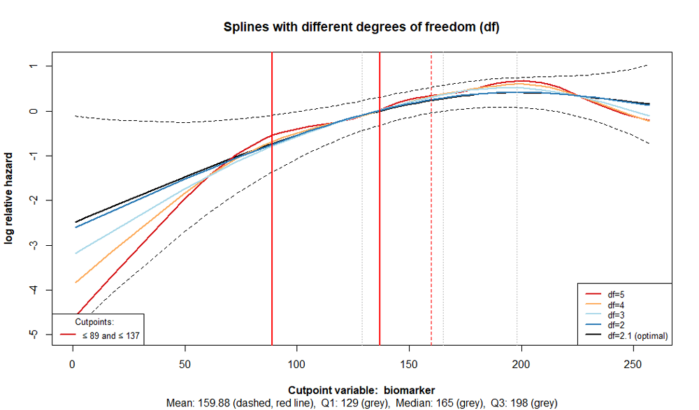
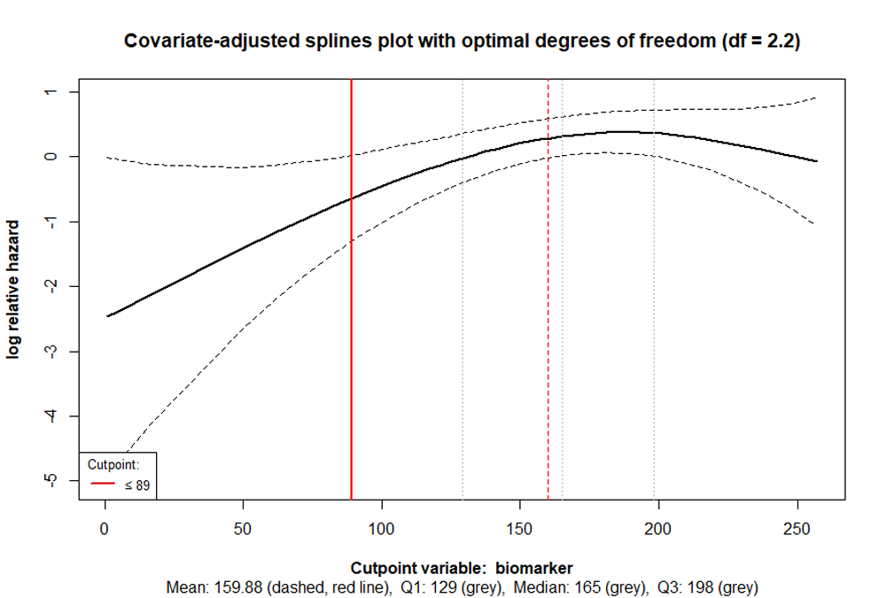
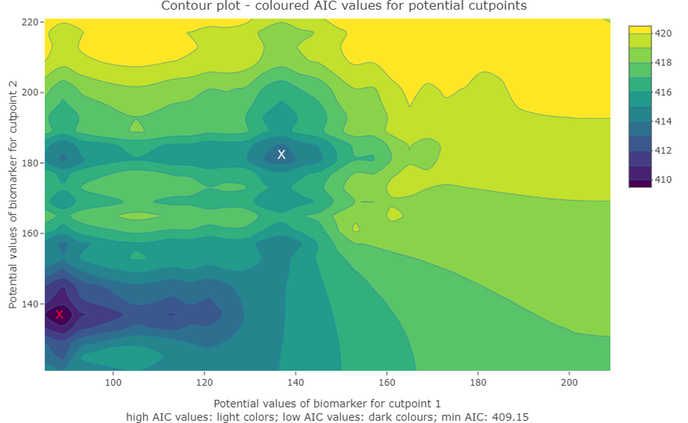

<!-- README.md is generated from README.Rmd. Please edit that file -->

# cutpoint

<!-- badges: start -->
<!-- badges: end -->

The R package `cutpoint` is used to determine cutpoints of variables,
such as biomarkers, in the multivariable context of survival or
time-to-event analyses. These cutpoints are used to form groups that
have different probabilities of an event occurring.

For example, in medical research, cutpoints of biomarkers are formed to
classify patients into different risk groups regarding survival in tumor
diseases. Using the R package `cutpoint`, it is possible to estimate one
or two cutpoints for categorising a variable of interest while taking
other relevant variables into account. Thus, it is possible, for
example, in the medical context, not only to estimate a cutpoint based
on a single biomarker but also to consider other biomarkers or baseline
characteristics.

The R package `cutpoint` uses either the AIC (Akaike Information
Criterion) or the LRT (Likelihood-Ratio Test) to estimate the cutpoint
in the context of Cox regressions. The Likelihood Ratio Test (LRT)
statistic is calculated by taking the scaled difference between the
log-likelihoods of the model and the null model’s log-likelihoods.
Details on the methods can be found in the article by Govindarajulu, U.,
& Tarpey, T. (2022). Optimal partitioning for the proportional hazards
model. Journal of Applied Statistics, 49(4), 968–987.
<https://doi.org/10.1080/02664763.2020.1846690>

The `est_cutpoint` function estimates one or two cutpoints for a
biomarker. The argument `ushape` enables cutpoints to be estimated
assuming the splines plot displays a U-shaped or inverted U-shaped
curve. The `symtail` argument allows for the estimation of two
cutpoints, ensuring that the two outer tails represent groups of equal
size.

## Installation

You can install the development version of cutpoint from
[GitHub](https://github.com/) with:

``` r
# install.packages("pak")
pak::pak("jan-por/cutpoint")
```

## Example

Estimate two cutpoints of the variable biomarker under Consideration of
two other covariates.

This package includes the dataset data1 with 100 observations and
contains the variables:

- time, event, biomarker, covariate_1, and covariate_2

Because two cutpoints should be estimated, the argument nb_of_cp is set
to 2.

For the other arguments, their default settings are used:

- Min. group size in % (bandwidth) = 0.1

- Symmetric tails (symtails) = FALSE

- Cutpoints for u-shape (ushape) = FALSE

`library(cutpoint) cpobj <- est_cutpoint(`

`cpvarname = "biomarker",`

`covariates = c("covariate_1", "covariate_2"),`

`data = data1, nb_of_cp = 2)`

### Output:

The output displays the primary settings and estimates for the cut
points.

`cpobj <- est_cutpoint(cpvarname = "biomarker", covariates = c("covariate_1", "covariate_2"), data = data1, nb_of_cp = 2 )`

The argument bandwidth can change the minimum group sizes and may lead
to different cutpoint estimates.

### Visual evaluation of possible cutpoints

The value_plot and splines_plot functions are utilised to choose the
appropriate cutpoints.

The default plot of the function est_cutpoint is a splines plot with
different degrees of freedom:

`plot(cutpoint-package_value_plot_for_two_cutpoints)`

<figure>

<figcaption aria-hidden="true">Figure 1) Splines with different degrees
of freedom (df)</figcaption>
</figure>

The cutpoints are horizontal red lines, while the dashed red line
represents the mean of the variable of interest. The first quartile,
median, and third quartile are indicated in grey. The different degrees
of freedom should assist in determining whether misspecification or
overfitting occurs. This the example does not appear to be one of those.
Therefore, we can use the function splines_plot and set the argument
show_splines to FALSE to obtain a clearer illustration:

`splines_plot(cpobj, show_splines = FALSE)`

<figure>

<figcaption aria-hidden="true">Figure 2) Splines plot with optimal
degrees of freedom</figcaption>
</figure>

### **Contour plots and Index plots**

The function value_plot enables to create contour plots and index plots.
For this, the AIC values of the cutpoint estimation process or the
Likelihood Ratio Test (LRT) statistic – values can be used.

The following figure is based on the same example as used before:

`value_plot(cpobj, plotvalues = "AIC", plottype2cp = "contour")`

The x-axis and y-axis represent potential cutpoint values, while the AIC
values from the estimation process are coloured. The lowest AIC values
are in dark colours and may indicate potential cutpoints. The estimated
cutpoints from the previous example are ≤ 89 and ≤ 137 (marked by the
red cross). Other potential cut points, for example, are ≤ 137 and ≤ 181
(marked by the white cross). The smaller the \`bandwidth\` (minimum
group size per group), the more precise and meaningful the contour plots
can be interpreted.

<figure>

<figcaption aria-hidden="true">Figure 3) Contour plot shows coloured AIC
values and potential cutpoints</figcaption>
</figure>

Index plots that don´t show clear extreme values suggest that a real
cutpoint may not exist in the data. The same applies to contour plots,
which show only three or four colors for the AIC or LRT statistic
values. However, even if there is no true cutoff in the data, cutoff
points can still be established, allowing for the formation of groups
with different probabilities of an event occurring.
